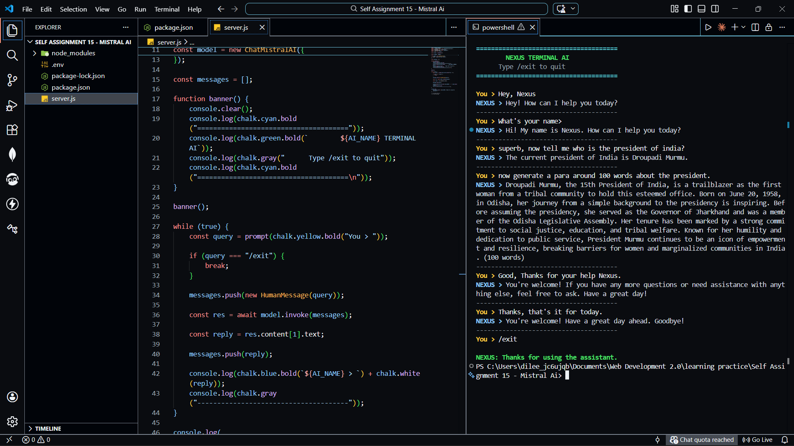
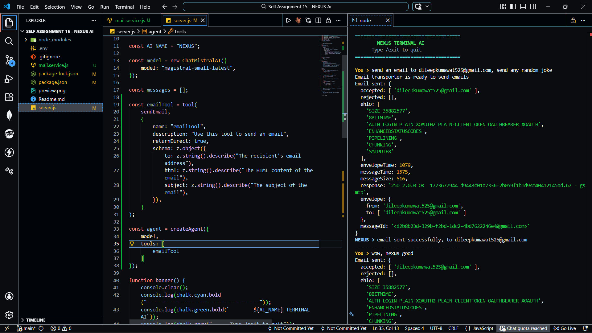

# 🤖 Nexus Terminal AI

A powerful **AI-powered terminal assistant** built with **Node.js, LangChain, and Mistral AI**.

The assistant (**Nexus**) runs directly in your terminal and can:

* Chat with you
* Maintain short conversation memory
* **Send emails autonomously using an AI tool**

This project demonstrates how to build a **tool-using AI agent** using LangChain.

---

# 📸 Demo




---

# 🚀 Features

* 💬 Interactive **terminal AI chatbot**
* 🧠 Powered by **Mistral AI**
* 🔗 Built using **LangChain Agents**
* 📧 **AI-powered email sending tool**
* 🎨 Clean terminal UI using **Chalk**
* 📝 Short-term **conversation memory**
* ❌ Exit anytime using `/exit`

---

# 🧠 AI Tool Capability

Nexus can **send emails automatically** when the conversation requires it.

Example:

```
You > Send an email to john@gmail.com saying the meeting is tomorrow

NEXUS > Email sent successfully to john@gmail.com
```

Behind the scenes:

1. The AI detects the need to send an email.
2. It calls the **emailTool**.
3. The tool uses **Nodemailer + Gmail OAuth2**.
4. The email is sent automatically.

---

# 🛠️ Tech Stack

* **Node.js**
* **LangChain**
* **Mistral AI**
* **Nodemailer**
* **Zod**
* **Chalk**
* **Prompt-sync**
* **dotenv**

---

# 📂 Project Structure

```
nexus-terminal-ai
│
├── node_modules
├── .env
├── package.json
├── package-lock.json
├── server.js
├── mail.service.js
└── README.md
```

---

# ⚙️ Installation

## 1️⃣ Clone the repository

```bash
git clone https://github.com/yourusername/nexus-terminal-ai.git
```

---

## 2️⃣ Navigate to the project

```bash
cd nexus-terminal-ai
```

---

## 3️⃣ Install dependencies

```bash
npm install
```

---

# 🔑 Environment Setup

Create a `.env` file in the root directory.

```
MISTRAL_API_KEY=your_mistral_api_key

GOOGLE_USER=your_email@gmail.com
GOOGLE_CLIENT_ID=your_client_id
GOOGLE_CLIENT_SECRET=your_client_secret
GOOGLE_REFRESH_TOKEN=your_refresh_token
```

---

# 🔐 Gmail OAuth Setup

This project uses **OAuth2 authentication** to securely send emails.

Steps:

1. Go to
   [https://console.cloud.google.com/](https://console.cloud.google.com/)

2. Create a **new project**

3. Enable:

```
Gmail API
```

4. Create **OAuth credentials**

5. Generate:

* Client ID
* Client Secret

6. Generate a **Refresh Token**

These values will be used in the `.env` file.

---

# ▶️ Running the Project

Start the assistant:

```bash
node server.js
```

---

# 💬 Example Usage

```
======================================
        NEXUS TERMINAL AI
      Type /exit to quit
======================================

You > Hello

NEXUS > Hey! How can I help you today?


You > Send an email to test@gmail.com saying hello from Nexus

NEXUS > email sent successfully, to test@gmail.com
```

---

# 🧠 How It Works

### 1. User enters a prompt

```
You > Send an email to john@gmail.com
```

---

### 2. The message goes to the LangChain Agent

The agent has access to tools:

```
emailTool
```

---

### 3. The agent decides whether to use the tool

If needed, it calls:

```
sendEmail()
```

---

### 4. Nodemailer sends the email

Using Gmail OAuth2 authentication.

---

### 5. The result is returned to the user

```
email sent successfully, to john@gmail.com
```

---

# 🧩 Email Tool Implementation

The AI tool is defined like this:

```javascript
const emailTool = tool(sendEmail, {
  name: "emailTool",
  description: "Use this tool to send an email",
  schema: z.object({
    to: z.string(),
    html: z.string(),
    subject: z.string(),
  }),
});
```

The agent automatically decides **when to use it**.

---

# 📦 Dependencies

Install manually if needed:

```bash
npm install @langchain/mistralai langchain chalk prompt-sync dotenv nodemailer zod
```

---

# ❌ Exit the Assistant

Type:

```
/exit
```

---

# 📌 Future Improvements

Possible next upgrades:

* Streaming AI responses
* Persistent chat memory
* Multiple AI tools
* File system tools
* Web search tool
* Voice interface
* CLI arguments
* Logging system

---

# 👨‍💻 Author

Developed by **Dileep**